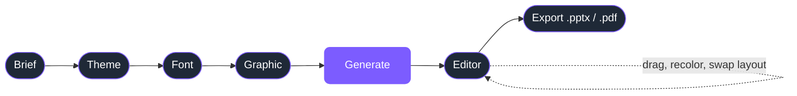
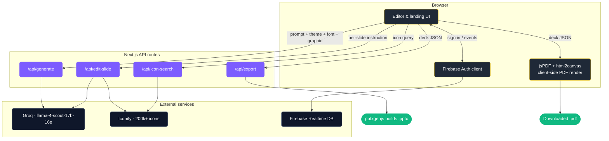
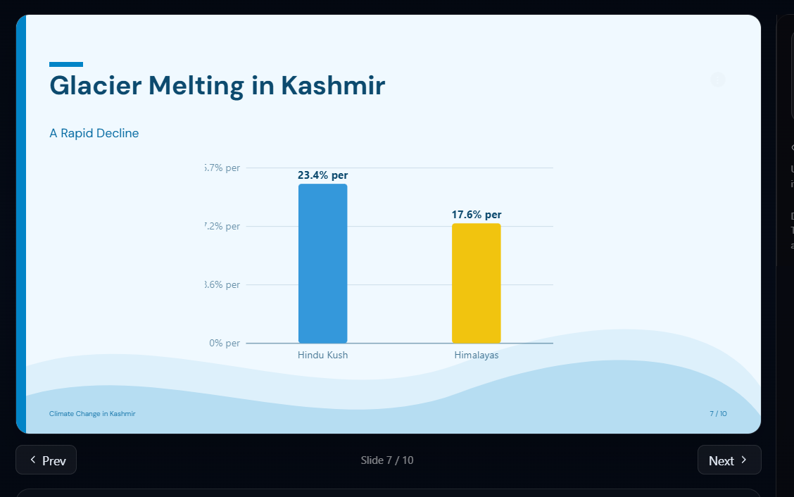
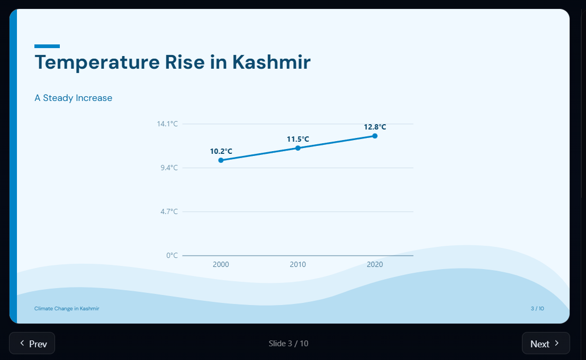

# EXdeck

AI presentation builder. Type a short prompt, pick a theme, get an editable deck in seconds. Drag text boxes, edit them inline, swap colors, drop in charts and icons, ask the chat to rewrite a slide, and export to PowerPoint or PDF.

Live preview, full-screen presenter mode, slide reorder, and a 200,000-icon library all included.

## How it works

The user-facing flow is five steps. The shape doesn't change between sessions — only the content does.



Under the hood, the browser stays thin. Long-running and key-sensitive work happens on Next.js API routes; everything else (drag, edit, recolor, PDF render) runs entirely client-side.



Three patterns hold the system together:

1. **Single deck object** — the entire presentation lives in one typed `Deck` shape (`lib/types.ts`). Every page and every API route reads and writes it. No hidden state.
2. **Pure-function rendering** — `SlideCanvas` is the same component used in the editor, the thumbnail rail, the present mode, and the off-screen PDF capture. One source of visual truth.
3. **Server is a thin proxy** — the Next.js API routes only do what the browser cannot: hold the Groq key, hit Iconify for search, and run pptxgenjs for the binary `.pptx`. Everything else is client-side.

## Showcase

The generator now builds **real data visuals** — bar, line, area, pie, and donut charts — directly into the deck when the topic has numbers worth showing. Charts are rendered as crisp vectors that survive both PDF and PowerPoint export, colored from the selected theme, and resizable from the side panel.

<p align="center">
  
</p>

<p align="center">
  
</p>

The AI decides on its own whether a chart belongs and which type fits the data — a time trend becomes a line chart, a budget split becomes a pie, category comparisons become bars. If a topic has no real numbers, it stays with text rather than inventing data.

## Features

- Five-step generator: brief → theme → font → graphic → deck
- Nine slide layouts: title hero, bullets, table, **data chart**, two-column, quote, section, references, closing
- **AI-generated data charts** — bar, line, area, pie, and donut, built from the topic's real figures, theme-colored, resizable, and exported as vectors to both PPTX and PDF
- The model picks the layout per slide (chart, table, two-column, bullets) based on what the content actually is — no fixed template, so every deck looks different
- 32 themes paginated across four pages, plus full custom colors
- 18 hand-picked Google Fonts with live previews
- 22 background graphic styles, recolorable per deck
- 36 in-house decorations (charts, infographics, layouts) plus 200k searchable icons via Iconify
- Density slider so you can choose how packed each slide is
- Per-slide AI chat that knows the deck topic, theme, all slide titles, and existing graphics
- Drag-and-drop text boxes with PowerPoint-style font sizes
- Inline text editing on every box (click, edit, blur to save)
- Click any graphic to recolor it from a swatch picker
- Image upload with free positioning and resize
- Corner annotations the AI can place via natural language
- Optional references slide auto-inserted before the closing
- Slide reorder, duplicate, insert, delete from the thumbnail rail
- Full-screen Present mode with PowerPoint-style shortcuts (arrows, B for blank, type-to-jump)
- Real `.pptx` and `.pdf` export, both pixel-mirroring the on-screen design
- 10-second generate animation with progress steps so fast generations still feel deliberate
- Firebase Auth (email and Google) with stats events written to Realtime DB
- Multi-key Groq fallback so a rate limit on one key auto-switches to another

## Stack

- Next.js 14 with the App Router
- TypeScript and Tailwind
- Groq SDK (model `meta-llama/llama-4-scout-17b-16e-instruct`)
- Iconify for icon search
- pptxgenjs for PowerPoint export
- jsPDF and html2canvas for PDF export
- Firebase Auth and Realtime Database
- Lucide for UI icons

## Setup

```bash
git clone https://github.com/izhan0102/Deckflow.git
cd Deckflow
npm install
cp .env.local.example .env.local
# fill in the values, then
npm run dev
```

Open http://localhost:3000.

### Required env vars

```
GROQ_API_KEY=your_groq_key
GROQ_API_KEY_FALLBACK=optional_second_key

NEXT_PUBLIC_FIREBASE_API_KEY=...
NEXT_PUBLIC_FIREBASE_AUTH_DOMAIN=...
NEXT_PUBLIC_FIREBASE_PROJECT_ID=...
NEXT_PUBLIC_FIREBASE_STORAGE_BUCKET=...
NEXT_PUBLIC_FIREBASE_MESSAGING_SENDER_ID=...
NEXT_PUBLIC_FIREBASE_APP_ID=...
NEXT_PUBLIC_FIREBASE_DATABASE_URL=...
```

The Groq key is server-only. The Firebase `NEXT_PUBLIC_*` values are client-side and public by Google's design, protected by Auth authorized domains and Realtime Database security rules.

## Routes

- `/` — landing page with feature tour and live counters
- `/auth` — sign in / sign up (email and Google)
- `/app` — the generator and editor (requires sign-in)
- `/privacy`, `/terms`, `/refund`, `/shipping`, `/contact` — legal pages

## API Routes

The application uses a small set of API routes to handle tasks that cannot safely or efficiently run in the browser.

### `/api/generate`

Generates a complete presentation from a user prompt and selected design settings.

**Input**

* Presentation brief
* Theme selection
* Font selection
* Graphic style
* Density preferences

**External Services**

* Groq API

**Output**

* Fully structured `Deck` object containing slides, layouts, content, and design metadata

---

### `/api/edit-slide`

Applies AI-powered edits to an individual slide without regenerating the entire presentation.

**Input**

* Current slide content
* User instruction
* Deck context

**External Services**

* Groq API
* Iconify API (when icons are requested)

**Output**

* Updated slide content and layout data

---

### `/api/export`

Creates downloadable PowerPoint files from the current deck.

**Input**

* Deck JSON object

**Libraries Used**

* pptxgenjs

**Output**

* `.pptx` presentation file

---

### `/api/icon-search`

Searches the Iconify icon library and returns matching icons.

**Input**

* Search query

**External Services**

* Iconify

**Output**

* Matching icon metadata and identifiers for use inside the editor


## Project structure

```
app/
  page.tsx              landing
  app/page.tsx          generator and editor
  auth/page.tsx         login / signup
  api/
    generate/           creates a deck from a prompt
    edit-slide/         applies a single-slide AI patch
    export/             builds the .pptx file
    icon-search/        proxy to Iconify search
components/             SlideCanvas, DeckPreview, Presenter, etc.
lib/
  groq.ts               deck generation prompt + parser
  groqClient.ts         multi-key Groq client with fallback
  layoutMath.ts         adaptive font sizes shared by preview and export
  graphics.ts           background graphic catalog (22)
  decorations.ts        in-deck decoration catalog (36)
  iconify.ts            Iconify search + URL builder
  fonts.ts              Google font presets (18)
  themes.ts             theme catalog (32)
  pdfExport.ts          client-side PDF builder
  firebase.ts           Firebase initialization
  auth.ts               sign-in helpers
  stats.ts              event tracking
  legal.ts              single source of truth for legal copy
```

## Notes

- Built by **Muhammad Izhan** — Computer Science undergraduate at RNS Institute of Technology, Bengaluru.
- LinkedIn: https://www.linkedin.com/in/muhammad-izhan-a404752a6/
- GitHub: https://github.com/izhan0102

## License

All rights reserved. The code is published for transparency and portfolio purposes; please do not redistribute or build a competing product without permission.
