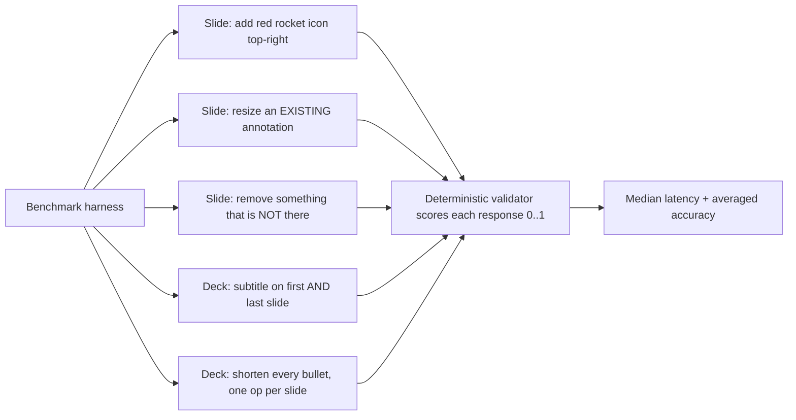
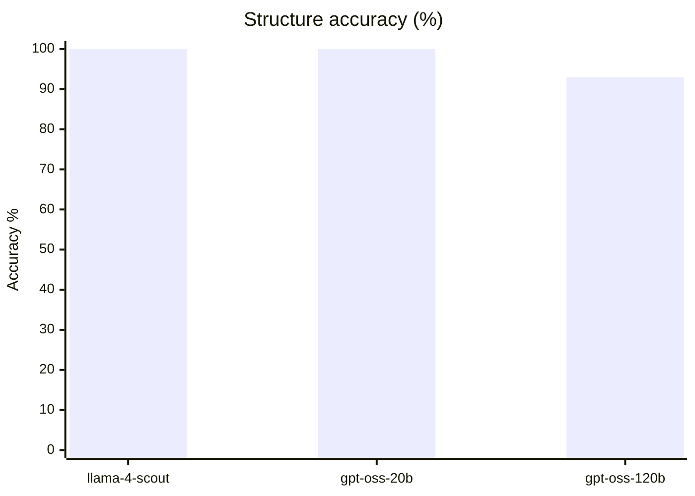
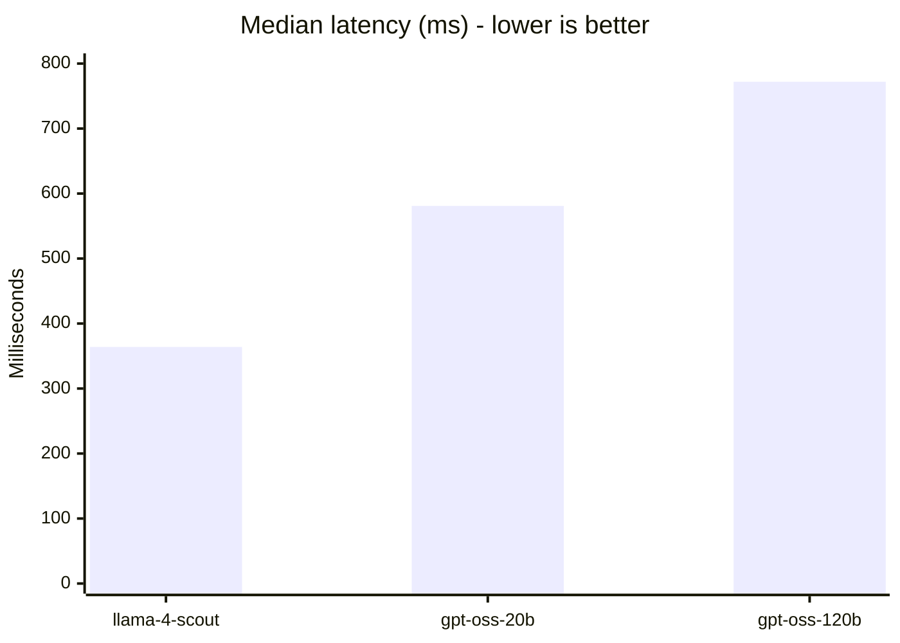
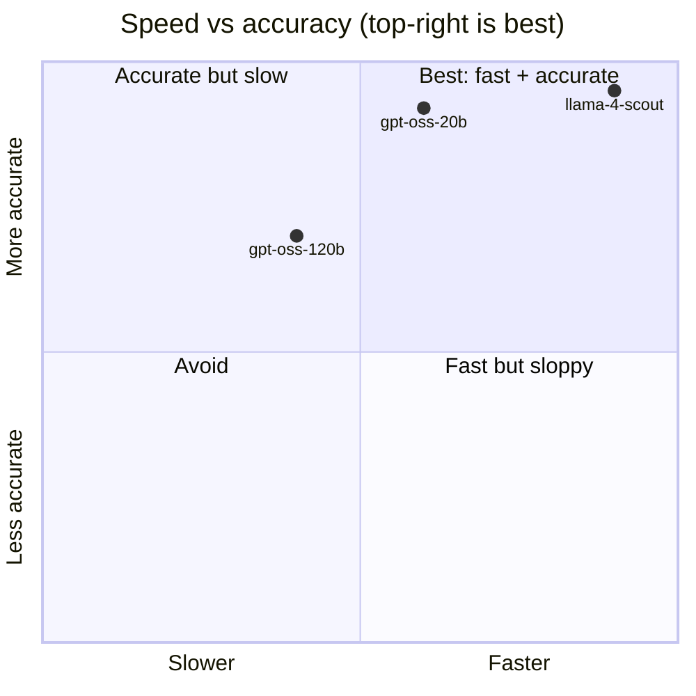
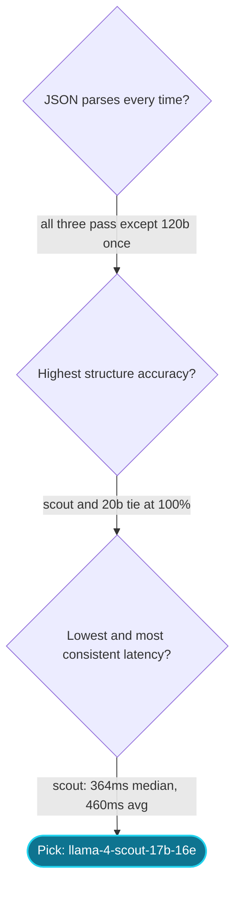

# Model Selection: Structured-Edit Routes

How we picked the LLM behind the AI editor (`/api/edit-slide` and
`/api/edit-deck`). These routes don't write prose, they emit a strict JSON
patch that the server applies to a slide or the whole deck. So the only
things that matter are:

1. Structure accuracy. Does it pick the right operation, the right target
   index, the right field?
2. Speed. The user is sitting there waiting for the slide to update.
3. JSON validity. A response we can't parse is a failed edit.

Token efficiency is a nice-to-have because the Groq free tier has a
tokens-per-minute ceiling, and leaner output keeps us further from it.

## Candidates

| Model | Why it was in the running |
|---|---|
| `openai/gpt-oss-120b` | What `/api/edit-slide` shipped with. Big, capable, but slow and rate-limited on the free tier. |
| `meta-llama/llama-4-scout-17b-16e-instruct` | Small MoE model, marketed as fast. Unproven for our JSON tasks. |
| `openai/gpt-oss-20b` | Smaller sibling of the 120b. Should be faster, similar family behavior. |

## How the test works

`scripts/model-bench.mjs` sends the same system + user message to each
model, forces JSON output (`response_format: json_object`), measures
wall-clock latency, and runs a deterministic validator on the parsed
response. Each task runs 3 times per model so one lucky or unlucky sample
doesn't skew the result.

Five tasks, chosen to mirror what the real routes actually do:



Tasks 2, 3, and 5 are the hard ones:

- Task 2 catches whether the model edits an existing element (the "increase
  size of team name" bug) instead of wrongly creating a new one.
- Task 3 catches hallucinated removals. The model must refuse and explain,
  not fabricate an edit.
- Task 5 catches whether the model emits one op per content slide and
  leaves the hero and closing untouched.

Run it yourself:

```bash
node --env-file=.env.local scripts/model-bench.mjs
```

## Results

3 models x 5 tasks x 3 runs = 45 calls. Numbers below are from a single
full run on the Groq free tier.

| Model | Accuracy | Median latency | Avg latency | Parse fails | Avg output tokens |
|---|---:|---:|---:|---:|---:|
| **llama-4-scout-17b-16e** | **100%** | **364 ms** | **460 ms** | **0** | **91** |
| gpt-oss-20b | 100% | 581 ms | 1876 ms | 0 | 338 |
| gpt-oss-120b (old) | 93% | 772 ms | 1127 ms | 1 | 287 |

### Accuracy (higher is better)



### Median latency (lower is better)



### The speed vs accuracy picture



> Axis values are normalized for placement, not raw measurements. The raw
> numbers are in the table above.

## Decision



**Winner: `meta-llama/llama-4-scout-17b-16e-instruct`.**

Why:

- **Roughly 2x faster than the old gpt-oss-120b** (364 ms vs 772 ms median).
  The edit feels near-instant.
- **Perfect accuracy** on all five tasks, including the annotation-edit and
  hallucinated-removal cases the 120b model previously fumbled.
- **Most consistent latency.** gpt-oss-20b matched on accuracy but its
  average latency was erratic (1876 ms, one run spiked hard). Scout's
  average (460 ms) stays close to its median, so the experience is
  predictable.
- **Leanest output** (91 tokens avg vs 287/338). Tighter JSON, less filler,
  more TPM headroom on the free tier.

Why not the others:

- **gpt-oss-120b** is the worst of the three for this job. Its reasoning
  depth is wasted on structured emission, it's slower, and it's the most
  rate-limited on the free tier (it hit a 429 mid-run and dropped a task).
- **gpt-oss-20b** is a fine fallback, accurate but with unpredictable
  latency spikes.

Combined ranking (70% accuracy / 30% speed):

```
1. llama-4-scout-17b-16e   (combined 86)
2. gpt-oss-20b             (combined 77)
3. gpt-oss-120b            (combined 65)
```

## Scope and caveats

- This benchmark covers the **structured-edit** routes only. Deck
  **generation** (`lib/groq.ts`) is creative long-form work with a much
  heavier prompt, and is evaluated separately. Don't assume this result
  transfers there.
- The harness uses simplified prompts, not the full production system
  prompts. The speed and structure signal is strong and directional, but
  exact accuracy on the real prompts may shift a few points.
- Numbers are from the Groq free tier and will move with load and rate
  limits. Re-run `scripts/model-bench.mjs` if you want fresh data.
